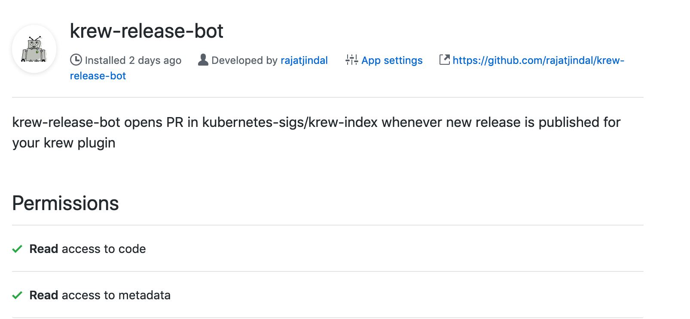

<a href="https://github.com/rajatjindal/krew-release-bot"></a><span width="10px">

`krew-release-bot` is a bot that automates the update of `krew-index` on the release of new version of your `krew` (or `kubectl`) plugin.

This bot can be receive events in one of the following ways:

- install [`krew-release-bot`](https://github.com/apps/krew-release-bot) github app. This app sends event to the bot when you pushlish the release manually for your plugin.
- or use `github-action` that sends the event to the bot. This is more useful when you have automated publishing release of your plugin as well using something like e.g. `goreleaser` or equivalent.


# Basic Setup

- Add a `.krew.yaml` template file at the root of your repo. Refer to [kubectl-evict-pod](https://github.com/rajatjindal/kubectl-evicd-pod) repo for an example.
- The bot will use `.krew.yaml` template and generate the plugin spec file for your plugin using information from the release and open the PR for `krew-index` repo.

## Configuration when using github app

#### How to Install

- Go to [`https://github.com/apps/krew-release-bot`](https://github.com/apps/krew-release-bot)
- Click on Configure
- Select the User/Org which owns the repo where you plan to install this app.
- Confirm Password (required by `github`). App don't get access to this password.
- Refer that `read` access is required to `code` and `metadata` to listen to `release` events.
- From `Repository Access` box, select the repositories where you want to enable it. You can enable for `all` or `only selected` repositories.
- Click Save and you are all set.

#### Permissions required

The github app needs `read` access to `code` and `metadata` of the repository. Refer to the screenshot below:



## Using github actions

- Make sure you have enabled github actions for your repo
- Once you have setup the actions/automation to publish the release with assets, just configure the job to run krew-release-bot action.

##### Example when using go-releaser

`<your-git-root>/.github/workflows/release.yml`

```yaml
name: release
on:
  push:
    tags:
    - 'v*.*.*'
jobs:
  goreleaser:
    runs-on: ubuntu-latest
    steps:
    - name: Checkout
      uses: actions/checkout@master
    - name: Setup Go
      uses: actions/setup-go@v1
      with:
        go-version: 1.13
    - name: GoReleaser
      uses: goreleaser/goreleaser-action@v1
      with:
        version: latest
        args: release --rm-dist
      env:
        GITHUB_TOKEN: ${{ secrets.GITHUB_TOKEN }}
    - name: Update new version in krew-index
      uses: rajatjindal/krew-release-bot@v0.0.20
      env:
        GITHUB_TOKEN: ${{ secrets.GITHUB_TOKEN }}
```

#### Example with using go-releaser but not using Go modules yet
`<your-git-root>/.github/workflows/release.yml`

```yaml
name: release
on:
  push:
    tags:
    - 'v*.*.*'
jobs:
  goreleaser:
    runs-on: ubuntu-latest
    steps:
    - name: Checkout
      uses: actions/checkout@master
      with:
        path: ${{ github.workspace }}/src/github.com/rajatjindal/kubectl-whoami
    - name: Setup Go
      uses: actions/setup-go@v1
      with:
        go-version: 1.13
    - name: GoReleaser
      uses: goreleaser/goreleaser-action@v1
      with:
        version: latest
        args: release --rm-dist
        workdir: ${{ github.workspace }}/src/github.com/rajatjindal/kubectl-whoami
      env:
        GITHUB_TOKEN: ${{ secrets.GITHUB_TOKEN }}
        GO111MODULE: off
        GOPATH: ${{ github.workspace }}
    - name: Update new version in krew-index
      uses: rajatjindal/krew-release-bot@v0.0.22
      with:
        workdir: ${{ github.workspace }}/src/github.com/rajatjindal/kubectl-whoami
      env:
        GITHUB_TOKEN: ${{ secrets.GITHUB_TOKEN }}

```

** You can also customize the release assets names, platforms for which build is done using .goreleaser.yml file in root of your git repo.

#### Why do you need the token
We use the token to ensure that the `caller` is authorized to request a release on your behalf. Without this any unauthorized user can mimic sending a release request on your behalf.

We do not log or store the token anywhere and it is used to do following verifications:
- Ensure that token is valid
- Ensure that token has access to the repo from where the release is being requested.
- Ensure that the owner (or org) of the repo is a prefix of homepage specified in already released plugin


# Limitations of krew-release-bot
- only works for repos hosted on github right now
- only supports one plugin per git repo right now
- The first version of plugin has to be submitted manually, by plugin author, to the krew-index repo
- The homepage in the plugin spec in krew-index is used to establish ownership. The repo from which the release is published should be the homepage of the plugin in already released plugin-spec.


# Kubernetes CLA

krew-release-bot is just a service to open PR on your behalf to release a new version of the krew-plugin. Your CLA agreement (that you did when submitting the new plugin to krew-index) is still applicable on these PR's. 
